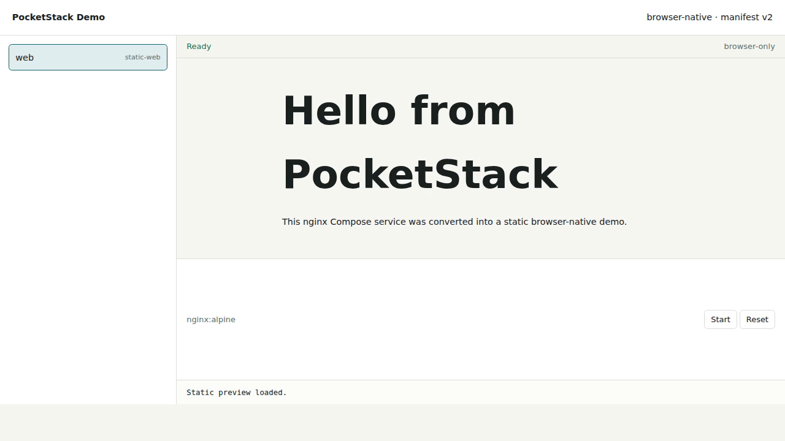

# PocketStack

PocketStack turns browser-compatible Docker Compose projects into shareable
demos that run as static browser apps.

> Drop in `docker-compose.yml`, get a static browser-native demo when every
> service can be mapped to browser primitives.

PocketStack v1 is intentionally browser-native. Generated demos do not start a
hidden server, upload projects to a runner, require Docker at demo time, or
pretend arbitrary Linux containers can run in a web page. If a service cannot
be represented honestly by a browser adapter, PocketStack gives you a
readiness report and concrete conversion suggestions.

Try it now: <https://ramazankara.github.io/pocketstack/>

[](docs/media/pocketstack-announcement.mp4)

## What You Can Demo

PocketStack is useful for projects that have a browser-native shape:

- static sites served by `nginx`, `httpd`, or `caddy`;
- frontend projects that can run with a Node/Bun browser runtime;
- prebuilt WASI modules;
- OpenAPI services that can be mocked from specs and fixtures;
- Postgres-flavored demos that fit PGlite;
- SQLite demos seeded from SQL or database files.

It is not a Docker replacement. Privileged containers, arbitrary daemons,
opaque volume behavior, and real Linux networking remain unsupported unless a
specific browser adapter exists.

## Install

Download the latest binary from
[GitHub Releases](https://github.com/ramazankara/pocketstack/releases/latest),
or build from source:

```sh
git clone https://github.com/ramazankara/pocketstack.git
cd pocketstack
nvm use
npm ci
npm run build:wasi-example
npm run build:runtime
go build -o bin/pocketstack ./cmd/pocketstack
```

The JavaScript toolchain targets the current Node line, Node 26.

## Quick Start

Analyze a Compose project:

```sh
pocketstack analyze -f compose.yaml
```

The analyzer returns a browser-readiness score, supported adapters, blockers,
and next steps for services that need to be converted into browser-native
pieces.

Generate a browser-only demo:

```sh
pocketstack demo -f compose.yaml -o pocketstack-demo
```

Serve `pocketstack-demo/` from any static host. Frontend/WebContainer and some
WASI demos require COOP/COEP headers; PocketStack emits host config files when
they are needed. See [docs/HOSTING.md](docs/HOSTING.md).

## Studio

PocketStack Studio is a static browser page for quick compatibility checks.
Paste Compose YAML, upload a Compose file, and optionally add the project
folder so Studio can inspect mounted assets.

Use the hosted Studio at <https://ramazankara.github.io/pocketstack/studio/>,
or run it locally:

```sh
make studio
```

Open <http://127.0.0.1:4173/>. Use `make studio PORT=4174` if that port is
busy.

Studio runs entirely in the tab. It does not call a PocketStack backend,
Docker daemon, runner, or hidden server.

## Supported Adapters

- `static-web`: copies document-root files from `nginx`, `httpd`, or `caddy`
  services and previews them in an iframe.
- `frontend`: packages a Node/Bun project for browser runtime execution.
- `wasi`: runs an explicitly labeled prebuilt `.wasm` module.
- `mock-http`: serves OpenAPI routes and JSON fixtures from the demo service
  worker.
- `postgres-pglite`: maps supported Postgres demos to resettable PGlite
  browser storage.
- `sqlite`: runs SQLite from SQL or seed database assets in the browser.

Unsupported services are reported with concrete reasons and no server fallback.
See [docs/COMPATIBILITY.md](docs/COMPATIBILITY.md) for exact behavior and
limits.

## Product Boundary

PocketStack stays browser-native. It will not add a hidden Docker runner to
make unsupported services appear compatible.

That means full arbitrary Compose compatibility is not the v1 promise. The
promise is better for static demos: when a stack can become browser-native,
PocketStack packages it; when it cannot, PocketStack explains the gap and how
to reshape the demo.

## Examples

The public site includes generated demos for the built-in examples:

- [static web](https://ramazankara.github.io/pocketstack/demos/static-site/)
- [mock API](https://ramazankara.github.io/pocketstack/demos/mock-api/)
- [SQLite](https://ramazankara.github.io/pocketstack/demos/sqlite/)

Studio-ready example projects live under
[examples/uploaded](examples/uploaded/README.md). They are small enough to
read, upload, and use as templates for your own Compose files.

## Labels

```yaml
labels:
  pocketstack.adapter: frontend|wasi|mock-http|postgres-pglite|sqlite
  pocketstack.frontend.install: npm install
  pocketstack.frontend.start: npm run dev -- --host 0.0.0.0
  pocketstack.frontend.port: "5173"
  pocketstack.wasi.module: hello.wasm
  pocketstack.wasi.args: "--name PocketStack"
  pocketstack.mock.openapi: openapi.yaml
  pocketstack.mock.fixtures: fixtures
  pocketstack.mock.port: "8080"
  pocketstack.db.init: init.sql
  pocketstack.db.seed: seed.sql
  pocketstack.db.persist: indexeddb|memory
```

## Commands

```text
pocketstack analyze [-f compose.yaml] [--json]
pocketstack demo [-f compose.yaml] [-o pocketstack-demo]
pocketstack version
```

## Docs

- [Browser-only contract](docs/BROWSER_ONLY.md)
- [Compatibility matrix](docs/COMPATIBILITY.md)
- [Conversion guide](docs/CONVERSION_GUIDE.md)
- [Architecture](docs/ARCHITECTURE.md)
- [Static hosting](docs/HOSTING.md)
- [Website integration](docs/WEBSITE_INTEGRATION.md)
- [Browser testing](docs/BROWSER_TESTING.md)
- [Release process](docs/RELEASE.md)
- [Studio](studio/README.md)

## Release Checks

```sh
make release-check
```
