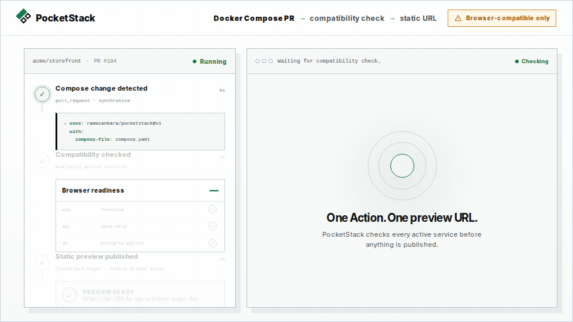

# PocketStack

Add one GitHub Action and get a static, shareable preview for every
**browser-compatible Docker Compose pull request**.

<p align="center">
  <a href="https://ramazankara.github.io/pocketstack/">
    
  </a>
</p>

<p align="center"><strong>Open a PR → check every service → share the static preview.</strong><br><sub>Unsupported containers stay explicit and never masquerade as a working preview.</sub></p>

PocketStack checks every active Compose service, maps compatible services to
browser adapters, generates static output, deploys it to a stable Cloudflare
Pages URL, and updates one pull-request comment on every push.

> [!IMPORTANT]
> PocketStack does not run arbitrary containers. If any active service needs
> Docker, Linux networking, a privileged process, or another unsupported
> runtime, the Action blocks the app deployment and publishes a compatibility
> report that says exactly why.

**[See the workflow](https://ramazankara.github.io/pocketstack/)** ·
**[Set up PR previews](docs/guide/pr-previews.md)** ·
**[Compatibility matrix](docs/adapters/index.md)**

## Add the Action

Create `.github/workflows/pocketstack.yml`:

```yaml
name: PocketStack Preview
on:
  pull_request:
    types: [opened, synchronize, reopened, closed]

permissions:
  contents: read
  pull-requests: write

jobs:
  preview:
    runs-on: ubuntu-latest
    steps:
      - uses: ramazankara/pocketstack@v1
        with:
          github-token: ${{ secrets.GITHUB_TOKEN }}
          compose-file: compose.yaml
          cloudflare-project: my-app-previews
          cloudflare-account-id: ${{ secrets.CLOUDFLARE_ACCOUNT_ID }}
          cloudflare-api-token: ${{ secrets.CLOUDFLARE_API_TOKEN }}
```

The Action checks out the PR and builds its trusted PocketStack CLI itself; the
workflow does not need a separate checkout or install step. Create the
Cloudflare Pages Direct Upload project and add the two repository secrets once.
The [PR preview guide](docs/guide/pr-previews.md) covers the exact setup,
permissions, lifecycle, and security model.

## What a pull request receives

| Result | Check | Stable PR URL |
| --- | --- | --- |
| Every service has a browser adapter | Passes | Working static app preview |
| Some services are compatible | Fails | Static compatibility report; no app preview |
| No services are compatible or analysis fails | Fails | Static blocker/error report; no app preview |
| PR comes from a fork or Dependabot | Reflects compatibility | No deployment or comment; secrets stay unavailable |
| PR closes | Passes after cleanup | Static closed-preview tombstone |

The job summary is always written. For same-repository PRs, one sticky comment
is created and updated instead of adding a new comment on every commit.

## Three working examples

These recognizable apps exercise the same adapters and generation path as PR
previews:

| Application | Compose services | Browser adapters |
| --- | --- | --- |
| [Pocket Supply storefront](examples/showcase/storefront/) | Vite storefront + fixture API | `frontend`, `mock-http` |
| [Northstar sprint board](examples/showcase/sprint-board/) | React board + Postgres seed | `frontend`, `postgres-pglite` |
| [Clearview analytics](examples/showcase/analytics/) | nginx static site | `static-web` |

The storefront includes search, cart, quantities, and checkout; the sprint
board supports issue creation, filtering, drag-and-drop, and keyboard moves;
the analytics dashboard includes date ranges, SVG chart tooltips, and a
sortable table.

## Compatibility is the product boundary

PocketStack has six browser adapters:

- `static-web` — static nginx, Apache, or Caddy document roots;
- `frontend` — Node/Bun source running in WebContainer;
- `mock-http` — OpenAPI routes and JSON fixtures;
- `postgres-pglite` — Postgres-shaped demos using PGlite;
- `sqlite` — seeded SQLite databases;
- `wasi` — prebuilt WebAssembly System Interface modules.

A project generates only when every active service maps to one of these
adapters. Arbitrary images, Dockerfile builds, Redis, opaque volumes, privileged
containers, and real container networking do not silently fall back to a
hosted runner. See [adapters](docs/adapters/index.md) and the
[conversion guide](docs/convert/index.md).

## Use the CLI locally

The GitHub Action is the shortest path to PR previews. The CLI exposes the same
analyzer and generator for local use:

```sh
# Explain every service mapping and blocker.
pocketstack analyze -f compose.yaml

# Generate only when the whole active stack is browser-compatible.
pocketstack demo -f compose.yaml -o pocketstack-demo
```

Download a binary from
[GitHub Releases](https://github.com/ramazankara/pocketstack/releases/latest)
or follow [installation](docs/guide/installation.md). Generated demos are plain
static files. Some adapters require COOP/COEP headers; PocketStack emits the
host configuration when needed.

## Security model

The preview workflow uses `pull_request`, never `pull_request_target`. It does
not start Docker or execute package scripts from the PR in the GitHub runner.
The analyzer confines Compose files, mounts, environment files, and labeled
assets to the checked-out repository and rejects symlink escapes. Fork and
Dependabot PRs do not receive Cloudflare credentials or a writable comment
token.

For details, read [PR preview security](docs/guide/pr-previews.md#security-model)
and [SECURITY.md](SECURITY.md).

## Documentation and development

- [Getting started](docs/guide/getting-started.md)
- [CLI reference](docs/guide/cli.md)
- [Hosting and headers](docs/deploy/hosting.md)
- [Architecture](docs/reference/architecture.md)
- [Contributing](CONTRIBUTING.md)

Licensed under [MIT](LICENSE).
